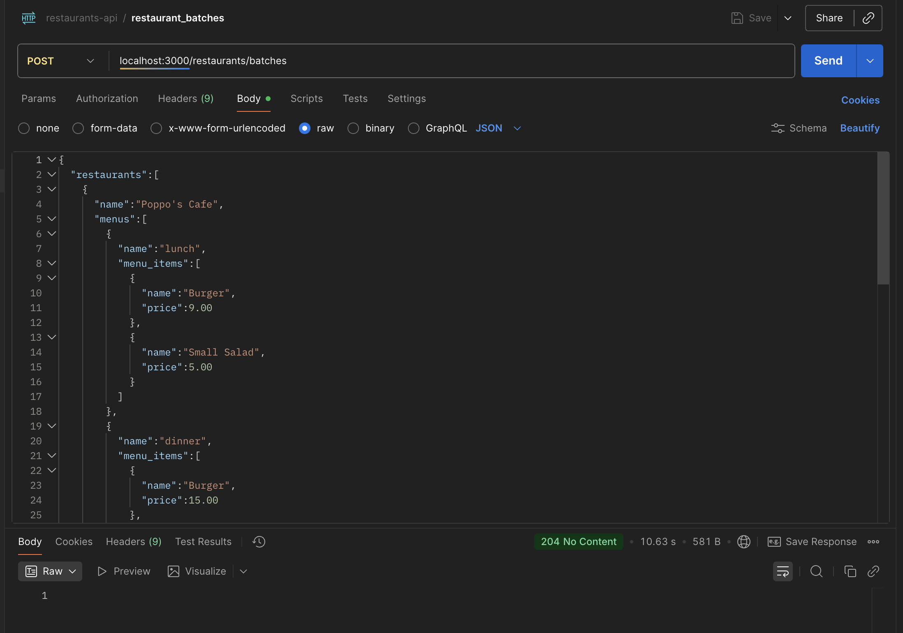

## Restaurant Menus
This system allows the creation and management of restaurants along with their menus, menu groups, and menu items. It exposes RESTful API endpoints following Rails conventions to perform standard CRUD operations.

Features
- Manage Restaurants and their associated Menus
- Manage Menu Groups and Menu Items within each menu
- Batch creation of restaurants, menus, and menu items with nested JSON input
- Logging for batch operations

Batch Creation API
The system supports a special action called Batches where you can submit a JSON payload with a key restaurants. This key contains multiple restaurants, each with nested menus and menu items. The batch endpoint processes the input by:

- Parsing nested JSON data
- Using a Data Transfer Object (DTO) to extract and convert input for the system
- Creating restaurants and their associated menus and menu items in batch
- Logging all successes or failures using Rails' basic Logger, including detailed information about each restaurant, menu, menu item, and any errors encountered

## Stack
**Rails 8, Ruby 3.2.**
### Test stack: 
**RSpec, FactoryBot, Faker.**

### The main feature can be tested as follow:
> POST restaurants/batches

**Pass a Body data in JSON format**

### File to use and test the restaurant batches creation:

> lib/data/restaurants.json



Logging
All batch operation results — success or failure — are logged using Rails' Logger to a log file called `restaurants_load_in_batches.log`. Logs include relevant data about the restaurants, menus, menu items, and detailed error messages if any operation fails.

## Test
- Just run the migrations. 
- Test endpoints as in the image.
- Run unit tests.

```
rspec
```